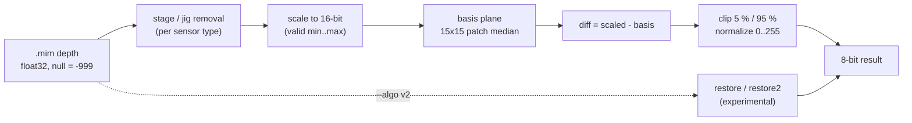
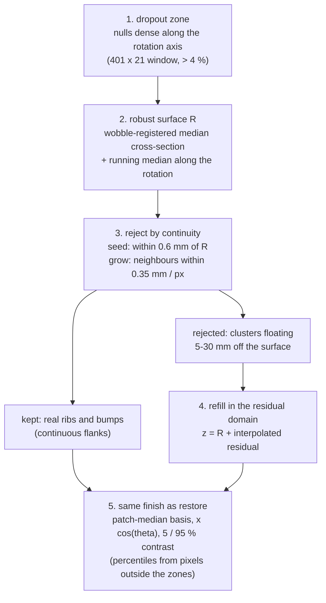

# DepthPreprocSim

Offline, **bit-exact** simulator of a production 3D depth pre-processing DLL (`alg_depth_preproc`: laser-profiler depth map → 8-bit inspection image), plus experimental restoration algorithms for null / dropout artifacts.

`C++17 core + CLI` · `zero-dependency Node.js viewer` · `Python verification`

## Highlights

- **Bit-exact** – 14 / 14 field images reproduced with 0 differing pixels, without MIL, the inspection framework or hardware.
- **Inspectable** – every intermediate stage is dumped (null mask, stage removal, basis plane, diff, clip) and browsable per pixel.
- **Explains the artifacts** – the black bands are *not* nulls (see [Findings](#findings)).
- **Experimental fixes** – `restore` and `restore2` keep measured pixels, repair the rest, and leave clean images unchanged.

## How it works



The solid path is a verbatim copy of the production functions, linked against the same OpenCV binary and toolset, so the output is byte-identical. The dashed path is the experimental branch.

## Quick start

```bat
build.bat                                   :: CMake + MSVC v142 + OpenCV 4.4.0  ->  build\Release\depth_sim.exe

depth_sim.exe run   --in 7_SWU_Sh_R_D.mim --ref 12_SWU_Sh_R_D_Proc.mim --out runs\demo --ini alg_depth_preproc.ini --cal 3
depth_sim.exe batch --folder <tire_folder> --out runs\tire --fovproc FOVPROC.ini --ini alg_depth_preproc.ini

node ui\server.js --port 8765               :: viewer at http://localhost:8765 (no npm install)
```

`run` writes `result.png`, the intermediate layers and `stats.json` (null ratio, clip levels, black / white share, comparison with `--ref`).

The viewer shows all layers with synchronized zoom / pan, a pixel inspector (raw z, basis, diff, result, ref), A/B toggle and a batch table.

## Algorithms

| | `site` (default) | `restore` | `restore2` |
|---|---|---|---|
| Purpose | replica of the production DLL | cleaner image, same look | + repairs dropout bands |
| Nulls | kept as 0, **included** in median and percentiles | interpolated, excluded from statistics | same |
| Wrong "valid" depths | kept | isolated spikes only | clusters rejected by surface continuity |
| Steep walls | vertical deviation | slope correction (× cos θ) | same |
| Output 0 means | null **or** lower clip | outside the tire band only | same |
| Time, 8192 × 1940 | 1.2 s | 4.2 s | 4.7 s |

```bat
depth_sim.exe run ... --algo v2 --v2-mode restore2 --v2-norm pct --v2-edge 1
```

### restore2



Refilled pixels are estimates. `hole_mask.png`, `rejected_mask.png` and `zone_mask.png` are written next to the result.

| Dropout sample, inside the zones | `restore` | `restore2` | clean area (by design) |
|---|---|---|---|
| saturated black + white, image 1 | 26.5 % | 12.9 % | 10.4 % |
| saturated black + white, image 2 | 25.6 % | 13.5 % | 10.4 % |

On the clean sample at most 0.53 % of the pixels outside the zones change.

## Findings

| # | Finding | Evidence from the raw depth |
|---|---|---|
| 1 | **The black bands are not nulls** | In a clean image 95–98 % of the black pixels inside the tire band are valid depths cut by the lower 5 % clip. A vertical sensor sees a texture of height *t* as *t / cos θ*, so the clip piles up on steep walls: 35 % of the pixels on the steepest rows vs. 5 % on average. Slope correction brings that to ~11 %. |
| 2 | **Dropout bands also contain wrong depths** | On a glossy surface the sensor returns clusters that float 5–30 mm below the real surface and are flagged valid (up to 4.4 % of the band). Interpolating nulls alone turns them into blobs. |
| 3 | **The raw depth reveals the mechanics** | One image covers ~1.3 turns. The cross-section moves as a clean once-per-turn sinusoid: ±6.7 mm eccentricity in one scan vs. ±1.0–1.7 mm otherwise, which roughly doubles the null ratio. |

## Verification

| Test | What | Result |
|---|---|---|
| T1 | 6 images of sample A vs. field output | 100 % identical |
| T2 | stage removal off | drops to 44–51 % (rule is really in the field build) |
| T3 | independent NumPy reference | 99.98–99.99 % exact, ±1 for the rest |
| T4 | batch of 8 images of sample B vs. field output | 100 % identical |
| T5 | CLI contract (exit codes, error JSON) | pass |

```bat
python tests\verify.py --exe build\Release\depth_sim.exe
```

Bit-exactness needs the same OpenCV binary, MSVC v142, `/fp:precise`, Release. Details in [docs/VERIFICATION.md](docs/VERIFICATION.md).

## Repository layout

```
core/        production functions (verbatim) + SimPipeline, MIM/TIFF reader, INI reader, stats, DepthPreprocV2 (experimental)
cli/         depth_sim.exe  (run | batch | info | version)
ui/          server.js + public/  - local viewer, Node built-ins only
tests/       verify.py, cases.json, NumPy reference, UI smoke test
reference/   snapshot of the field source the core was copied from
docs/        BUILD · CLI · UI · VERIFICATION (detailed, Korean)
Result/      analysis reports and scripts (run outputs are git-ignored)
```

## Documentation

[Build](docs/BUILD.md) · [CLI reference](docs/CLI.md) · [Viewer guide](docs/UI.md) · [Verification](docs/VERIFICATION.md) · [Design contract](DESIGN.md)

## Notes

- `restore` / `restore2` are experiments. They are not part of any DLL and change the input distribution of downstream models.
- Raw measurement data (`.mim`) and run outputs are not included in this repository.

---

**한국어 요약** – 현장 `alg_depth_preproc` DLL 과 비트 단위로 같은 결과를 내는 오프라인 시뮬레이터입니다. 중간 단계를 모두 볼 수 있고, 검은 띠(하위 5 % 클립)와 dropout 띠(null + 틀린 측정값)를 다루는 실험 알고리즘 `restore` / `restore2` 를 포함합니다. 상세 설명은 `docs/` 의 한국어 문서를 보십시오.
